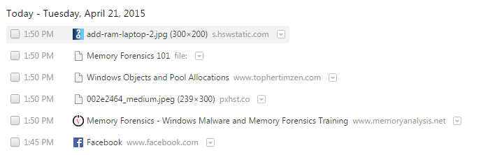

#Memory Forensics 101

---

#Who Am I?

Topher Timzen / C.Timzen@gmail.com

Security Researcher

Guest lecturer for Computer Science department 

Worked for the Department of Defense 

Slides available at tophertimzen.com/cs369/memoryForensics.html

---

#Today

Artifacts in memory

- How malicious actors use it 

- How analysts use it

Toolset for analysis

---

#Data Breaches

---

---

---

#So What?

Both Target and Home Depot suffered from attacks on their Point of Sale (POS) terminals.

**Ram Scrapers** were installed to the POS terminals and found credit card data living in memory. 

100+ million customer debit and credit cards stolen

	!python
	Visa: ^4[0-9]{12}(?:[0-9]{3})?$^5[1-5][0-9]{14}$ 
	Amex: ^3[47][0-9]{13}$

---

#Memory Forensics

---

#Random Access Memory

RAM stores code and data that the processor accesses. 

Volatile and always changing. 

- Loss of power eliminates everything in RAM 

- RAM is accessed frequently throughout operation and changes often

---

#RAM is Eventually put on Hard Drive

Hibernation

Pagefile

Word Documents

Files

Web Browser Cache

---

#What is in RAM?

RAM contains the state of the computer

- Programs
- Files
- Internet Connections
- Web Browser Activity
- Credit Cards
- Passwords
- Recently Opened files
- E-Mails 
- Network information
- Everything a user inputs.... 

---

#What do we care about?

Programs running and terminated

Browser History

Encryption Keys

Files recently opened

Programs recently opened

Commands recently ran 

Locating signs of Malware 

---

#Ethical Issues

Respect for suspects privacy and rights

Collateral Damage

Dual use of technology

---

#Why memory?

---

#Digital Evidence

Digital Information that was party to a criminal offense. 

Used by investigators to reach reliable inferences through analysis 

Needs to be

- Authentic 

- Unaltered 

- Acquired with permission or a warrant 

---

#Memory Acquisition

RAM is Volatile and should be collected first!

Artifacts of memory acquisition are leftover... 

- Does not change disk contents, much. 

Could leave machine in an unexpected state

Malware or other applications could crash the system..

- Measure the risk vs benefit of needing RAM

---

#Tools of the Trade

---

#Winpmem

Open-source memory acquisition tool

Reads contents of RAM and writes it to a file for analysis

Ruins sanctity of the host machines evidence... use AFTER everything else is acquired (Disk, Photos, etc) 

---

#Volatility

Framework for looking at a memory capture/image

Uses plugins to parse through an image

---

#Examples of using Volatility

---

#Process Lists Live System

---

#Process Lists Volatility

	!bash
	[root&windows]#volatility -f Lab2.vmem --profile=WinXPSP2x86 pslist
	Volatility Foundation Volatility Framework 2.4
	Offset(V)  Name                    PID   PPID   Thds     Hnds   Sess  Wow64 Start                          Exit
	---------- -------------------- ------ ------ ------ -------- ------ ------ ------------------------------ ------------------------------
	0x823c8830 System                    4      0     58      329 ------      0
	0x8231e020 smss.exe                544      4      3       19 ------      0 2015-04-04 00:08:35 UTC+0000
	0x82179020 csrss.exe               608    544     12      445      0      0 2015-04-04 00:08:38 UTC+0000
	0x81e72020 winlogon.exe            640    544     16      334      0      0 2015-04-04 00:08:38 UTC+0000
	0x82289228 services.exe            684    640     16      299      0      0 2015-04-04 00:08:38 UTC+0000
	0x81e6bc10 lsass.exe               696    640     19      363      0      0 2015-04-04 00:08:38 UTC+0000
	0x82247560 vmacthlp.exe            860    684      1       25      0      0 2015-04-04 00:08:40 UTC+0000
	0x822bada0 svchost.exe             876    684     21      235      0      0 2015-04-04 00:08:40 UTC+0000
	0x822bcda0 svchost.exe             980    684     10      306      0      0 2015-04-04 00:08:41 UTC+0000
	0x82249a80 svchost.exe            1076    684     63     1220      0      0 2015-04-04 00:08:41 UTC+0000
	0x81f737a8 svchost.exe            1232    684      4       73      0      0 2015-04-04 00:08:42 UTC+0000
	0x82290c10 svchost.exe            1372    684     12      190      0      0 2015-04-04 00:08:42 UTC+0000
	0x8217a558 spoolsv.exe            1472    684     13      147      0      0 2015-04-04 00:08:43 UTC+0000
	0x822ca988 explorer.exe           1756   1680     19      717      0      0 2015-04-04 00:08:55 UTC+0000
	0x82187218 vmtoolsd.exe           1892   1756      6      163      0      0 2015-04-04 00:08:59 UTC+0000
	0x822c87f0 ctfmon.exe             1900   1756      1       88      0      0 2015-04-04 00:08:59 UTC+0000
	0x81db4020 svchost.exe            1956    684      5      108      0      0 2015-04-04 00:09:00 UTC+0000
	0x81da4578 svchost.exe            1992    684     10      343      0      0 2015-04-04 00:09:00 UTC+0000
	0x81d8cd00 vmtoolsd.exe            248    684      7      314      0      0 2015-04-04 00:09:00 UTC+0000
	0x81d6a620 TPAutoConnSvc.e        1808    684      5      116      0      0 2015-04-04 00:09:10 UTC+0000
	0x821fd980 alg.exe                1752    684      5      104      0      0 2015-04-04 00:09:10 UTC+0000
	0x81d60020 wscntfy.exe            1912   1076      1       37      0      0 2015-04-04 00:09:11 UTC+0000
	0x81eef8a0 TPAutoConnect.e        1608   1808      1       78      0      0 2015-04-04 00:09:12 UTC+0000
	0x81ed5da0 wuauclt.exe            1680   1076      3      111      0      0 2015-04-04 00:10:10 UTC+0000
	0x81d495e0 TSVNCache.exe          1652   1756     10       59      0      0 2015-04-04 02:00:46 UTC+0000
	0x81d79da0 iexplore.exe           1052   1756     12      484      0      0 2015-04-06 19:03:42 UTC+0000
	0x81fa8ad0 iexplore.exe           1332   1052     20      797      0      0 2015-04-06 19:03:46 UTC+0000
	0x81cd57b8 taskmgr.exe            3924   1756      3       84      0      0 2015-04-07 03:21:23 UTC+0000
	
	
---

#Web Browser History

---

#Web Browser History

	!bash
	[root&windows]#volatility -f Lab2.vmem --profile=WinXPSP2x86 iehistory | grep Location
	Location: https://www.python.org/static/js/libs/modernizr.js
	Location: https://www.python.org/static/stylesheets/style.css
	Location: https://www.python.org/static/fonts/Pythonicon.eot
	Location: http://www.zone62.com/templates/fagus_c2/images/blockheader.png
	Location: http://www.zone62.com/modules/mod_cblogin/mod_cblogin/username.png
	Location: http://www.zone62.com/modules/mod_cblogin/mod_cblogin/password.png
	Location: http://www.zone62.com/images/joomgallery/thumbnails/full_hd_wallpapers_2/nature_3/nature_picture_248_20130307_1345247686.jpg
	Location: http://www.zone62.com/images/joomgallery/thumbnails/full_hd_wallpapers_2/digital_art_9/digital_art_picture_41_20130307_1877512233.jpg
	Location: http://www.zone62.com/images/joomgallery/thumbnails/full_hd_wallpapers_2/digital_art_9/alienware_picture_1_20130616_1961807936.jpg
	Location: http://www.zone62.com/templates/fagus_c2/images/block.png
	Location: http://www.zone62.com/images/joomgallery/thumbnails/full_hd_wallpapers_2/nature_3/nature_picture_243_20130307_1894524863.jpg
	Location: http://www.microsoft.com/net/content/NetUniverse/GeneratedImages/dzc_output_files/12/7_3.jpg
	Location: http://www.microsoft.com/net/content/NetUniverse/GeneratedImages/dzc_output_files/12/4_3.jpg
	Location: http://www.microsoft.com/net/content/NetUniverse/GeneratedImages/dzc_output_files/12/8_4.jpg
	Location: http://www.microsoft.com/net/content/NetUniverse/GeneratedImages/dzc_output_files/12/8_7.jpg
	Location: http://www.microsoft.com/net/content/NetUniverse/GeneratedImages/dzc_output_files/12/2_5.jpg
	Location: http://www.microsoft.com/net/content/NetUniverse/GeneratedImages/dzc_output_files/12/3_8.jpg
	Location: http://www.microsoft.com/net/content/NetUniverse/GeneratedImages/dzc_output_files/12/7_3.jpg
	Location: http://www.microsoft.com/net/content/NetUniverse/GeneratedImages/dzc_output_files/12/4_3.jpg
	Location: http://www.microsoft.com/net/content/NetUniverse/GeneratedImages/dzc_output_files/12/8_4.jpg
	
		
---

#Web Browser History

Private browsing lives in RAM

- Not really private, anyway 

Passwords

Pictures

Files downloaded

Search terms

---

#Finding Malware

Malware is a category of malicious code that includes viruses, worms, and Trojan horses.

Primary goal of memory analysis

Hard to do with live system

- Malware hides itself

- Alters the system

- Prevents certain actions

---

#Malware

Zeus 

- Computer worm that targeted banking information with key logging

Stuxnet 

- Computer worm that targeted programmable logic controllers (PLCs).

- Damaged Iranian nucleear program

#Malicious Actors

APT1

APT30

---

#Malware and Volatility

Volatility has several plugins that find and inform an investigator about malware

Locate how, what and why malware was on a system

Locate Malware persistence 

Discover Malware purpose

Inform victim of breach 

---

#Conclusion

Memory forensics is a new and evolving field

Used to find indicators of Malware or foul play

Used by malicious actors

Requires low level understanding of operating system 

---

#Questions?

